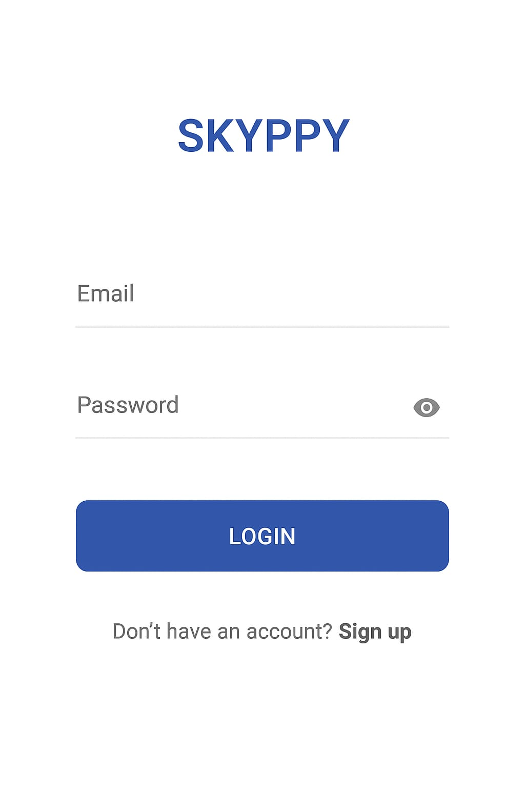
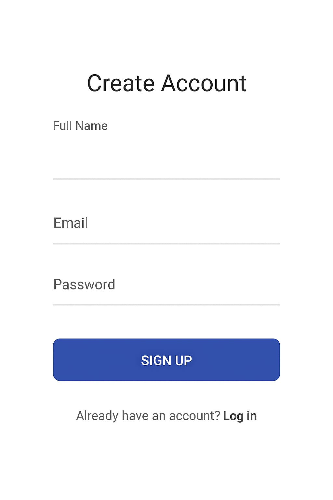
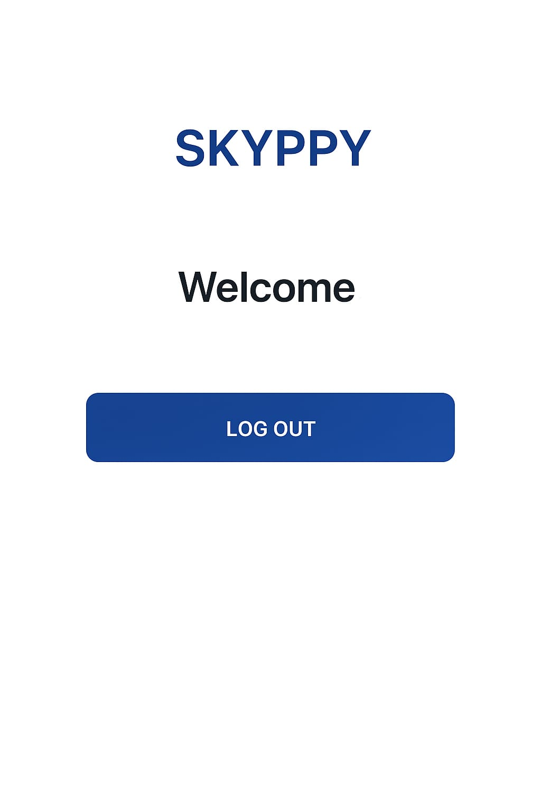

# 🌤️ SKYPPY – Jetpack Compose + Firebase Authentication App

> A modern, minimalistic Android app built using **Jetpack Compose**, **Firebase Authentication**, and **Kotlin** — featuring smooth navigation, reactive ViewModel logic, and a clean UI for a seamless login and signup experience.

---

## 🧠 Project Overview

**SKYPPY** is a personal Android project developed to explore and implement **Firebase Authentication** and **modern Android UI development** using **Jetpack Compose**.  
It demonstrates clean architecture, navigation, and reactive state management with **ViewModel** and **StateFlow**.

This app allows users to:
- ✨ Create a new account
- 🔑 Log in securely using Firebase Authentication
- 🚪 Log out safely
- 🏠 Navigate between login, signup, and home screens with ease

The project is ideal for demonstrating your understanding of **Compose UI**, **ViewModel**, and **Firebase integration** in Android interviews or academic submissions.

---

## 🚀 Features

✅ Firebase Authentication (Signup, Login, Logout)  
✅ MVVM Architecture (ViewModel + StateFlow)  
✅ Clean Navigation with Navigation Compose  
✅ Reactive UI built using Jetpack Compose  
✅ Material 3 Design Components  
✅ Modular and Scalable Code Structure  
✅ Easy to customize and extend

---

## 💻 Tech Stack

| Layer | Technology Used |
|-------|-----------------|
| Language | **Kotlin** |
| UI Framework | **Jetpack Compose (Material 3)** |
| Architecture | **MVVM (Model-View-ViewModel)** |
| Authentication | **Firebase Authentication** |
| Database | **Firebase Firestore (User details)** |
| Navigation | **Navigation Compose** |
| State Management | **StateFlow + ViewModel** |

---

## 🧩 App Structure

skyppy-app/
│
├── app/
│ ├── src/
│ │ ├── main/
│ │ │ ├── java/com/spoorthy/skippyapplication/
│ │ │ │ ├── navigation/ # NavGraph setup
│ │ │ │ ├── ui/screens/ # Login, Signup, Home screens
│ │ │ │ ├── viewmodel/ # AuthViewModel + AuthState
│ │ │ │ └── model/ # User data model
│ │ │ └── AndroidManifest.xml
│ │ └── res/
│ └── build.gradle
│
├── README.md # 📄 Project documentation
├── build.gradle
└── settings.gradle 

## 📸 Screenshots

Login Screen :

Secure user login with Firebase authentication.

Signup Screen :

Simple account creation with Firestore data saving.

Home Screen :

Displays a welcome message with logout functionality.
---

🛠️ Core Functionalities
| Functionality          | Description                                                   |
| ---------------------- | ------------------------------------------------------------- |
| 🔐 **User Signup**     | Creates account using Firebase Auth & saves user in Firestore |
| 🔑 **User Login**      | Validates credentials securely via Firebase                   |
| 🚪 **Logout**          | Signs out and returns to login screen                         |
| 🧭 **Navigation**      | Seamless transition between screens (Login → Signup → Home)   |
| 🧠 **ViewModel State** | Maintains login session and handles UI state with `StateFlow` |

🧱 Future Enhancements

🚀 Add password reset via Firebase
📆 Add mood journaling & daily notes
🎨 Implement user profile editing
☁️ Sync data across devices using Firestore
📊 Add analytics dashboard

💡 Learning Outcomes

✅ Hands-on experience with Jetpack Compose
✅ Integrated Firebase Authentication
✅ Applied MVVM + Navigation Compose architecture
✅ Built reactive UI using Kotlin coroutines and StateFlow
✅ Strengthened understanding of clean app structure and modern Android best practices

🧑‍💻 Developed By

Spoorthy M S
🎓 Computer Science & Engineering Student
📍 Vidyavardhaka College of Engineering
📧 spoorthyspoorthyms@gmail.com

